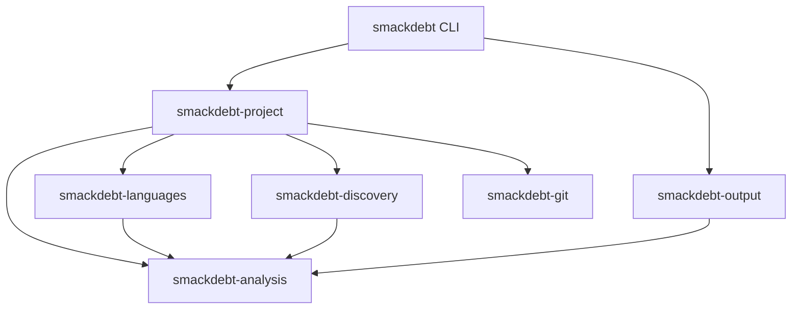

# Smackdebt architecture

Smackdebt answers two questions:

1. Where is the codebase debt, and which findings matter most now?
2. Did this worktree improve or worsen that debt compared with a Git ref?

The implementation favors small crates, inward dependencies, stable output,
and predictable memory use. Command behavior and JSON schema version 4 are the
product interfaces. Rust crate APIs remain private implementation seams.

## Crates and dependency direction



| Crate | Responsibility |
| --- | --- |
| `smackdebt-analysis` | Measurements, health policy, static graph algorithms, aggregation, comparisons, problem clustering, and report values |
| `smackdebt-languages` | File detection, compiled parser dispatch, and grammar-specific dependency syntax |
| `smackdebt-discovery` | One ignore-aware inventory and package assignment |
| `smackdebt-git` | Repository facts, history, status, refs, and object reads |
| `smackdebt-project` | Codebase and diff use cases, dependency resolution, and the Rayon pool |
| `smackdebt-output` | Terminal and JSON writers over borrowed source and graph facts |
| `smackdebt` | Arguments, dependency construction, streams, and exit codes |

Infrastructure crates do not depend on each other. Languages and discovery use
analysis-owned values at their seams, but do not depend on another adapter.
Project orchestration is the only place that composes filesystem, language, and
Git behavior. Internal Rust APIs remain implementation details. GitHub releases
distribute the CLI; registry publishing is disabled in release-plz.

Workspace checks read Cargo metadata and reject dependency edges outside this
diagram. Compiler-visible API snapshots make cross-crate surface changes
visible during review. All workspace crates forbid unsafe Rust.

## Module and API rules

`lib.rs` and `mod.rs` are wiring files. They may declare private modules,
import names, and explicitly reexport the small interface used by another
crate. They do not contain behavior, inline modules, wildcard reexports, or
tests. The CLI `main.rs` is an exception only for its call into the application
module and return of the process exit code.

Implementation stays in responsibility-led files. Analysis separates source
facts, health policy, comparisons, and completed reports. Language dispatch
keeps grammar-specific syntax separate from shared measurements. The
project crate separates public requests from execution, discovery separates
ignore matching from inventory, and output separates JSON serialization from
terminal presentation. The CLI separates arguments, configuration, terminal
policy, and application execution. Other crates add a module only when it gives
a responsibility a clear owner; file size by itself is not a reason to add a
layer.

Types own their behavior. A completed report is read-only outside analysis and
is created through `ReportBuilder`; callers cannot mutate its tables or rerun
aggregation. `Analyzer`, `Inventory`, `GitRepository`, project requests, and
output options likewise expose actions instead of public fields or plumbing
types. The `unreachable_pub` lint rejects public declarations that no consumer
can reach. The entry-module check and compiler-visible API snapshots run in the
architecture gate.

## Analysis module ownership

Metric names follow established terminology where it describes the actual
measurement. Each metric module owns its values, calculation, thresholds,
findings, and metric-specific comparisons and tests. Existing crate-root names
remain the cross-crate interface; the private file layout is not an API.

| Module in `crates/analysis/src` | Responsibility |
| --- | --- |
| `measurements.rs` | The five source measurements, retained as one value |
| `health.rs` | Their shared threshold policy and health counts |
| `code_churn.rs` | Added/deleted lines and distinct file/package commit touches |
| `package_change_coupling.rs` | Package co-change, explanations, findings, and comparisons |
| `file_change_coupling.rs` | File co-change across directories and pair retention |
| `code_ownership.rs` | Top contributor's commit share and knowledge concentration |
| `change_amplification.rs` | Median files touched per commit and scope summaries |
| `dependency_degree.rs` | Direct fan-in and fan-out |
| `instability.rs` | Outgoing coupling divided by total coupling |
| `stable_dependencies.rs` | Stable Dependencies Principle violations |
| `dependency_cycles.rs` | Cycle findings and largest-cycle size |
| `change_impact.rs` | Transitive dependency reach across files and packages |
| `hotspot.rs` | Rated code with frequent changes |
| `size.rs` | File lines and container statements |
| `orphan_files.rs` | Supported primary files without incoming references |
| `change_leakage.rs` | Smackdebt's join of change coupling and dependency evidence |

Change coupling is also called temporal or logical coupling. Code ownership
here means observed commit share. Change amplification uses Smackdebt's
nearest-rank median measurement of the design symptom. Change impact counts
potential dependants: repository-wide file reach excludes the changed file,
while package closures include their starting node. Module Rustdoc records
these populations, formulas, omissions, limits, and worked examples. Public
metric items require documentation through module-local `missing_docs` checks.

Shared source facts stay in `source.rs`, dependency tables and coverage in
`architecture.rs`, and history inputs and composition in `evolution.rs`.
`architecture_comparison.rs` owns comparisons spanning dependency edges and
cycles. Graph traversal, directory indexing, and median helpers retain their
algorithm names. Report assembly, verdict policy, and problem clustering stay
in their existing modules; they consume metric values instead of owning them.
Language-specific measurement extraction remains in the languages crate.

Build the source-level reference, including private metric modules, with:

```console
RUSTDOCFLAGS="-D rustdoc::broken_intra_doc_links" rtk cargo doc -p smackdebt-analysis --no-deps --document-private-items
```

## Analysis model

Inventory owns repository-relative paths. Analysis owns shared package and
report indexes, and discovery assigns the package index during its walk.
Language analysis produces a flat list of units per file. Each unit records:

- its name, container, kind, and source span;
- cognitive and cyclomatic complexity;
- exclusive logical lines;
- maximum nesting depth and parameter count;
- its parent unit index when nesting matters.

The health policy stores the five signals in fixed-size values. The highest
signal sets the result: `healthy`, `watch`, or `high`. Rating a unit does not
allocate.

The report uses flat arrays for paths, scopes, findings, diagnostics, activity,
and comparisons. Typed indexes connect related values. A path is interned once;
scopes and files refer to that path, and a comparison refers to its owning
file. A finding is owned once even when several parent summaries include its
rating. Full scans retain every `watch` and `high` finding and reduce healthy
units to counts.

The scope order is repository, package, directory, file, container, and unit.
Codebase and diff reports use the same repository-relative hierarchy.
`ProjectReport` records the initial selected scope separately from report
facts, so a renderer can show the repository, a package, or a directory from
one report.
Aggregation walks child scopes once in post-order and links retained findings
and comparisons through indexes. Parent scopes add counts; they never average
debt into a project score.

Analysis also owns the verdict: the one statement those counts support. Tier
identifiers are frozen as the machine contract and their sentences are owned
beside them, so a terminal renderer and a machine consumer print identical
bytes. A codebase tier comes from integer permille of High debt over checked
units, where a boundary value belongs to the lower tier, and package dependency
cycles floor the result at `worn` from one finding and at `fights_back` from
three. No floating-point value participates. A diff tier reconciles source,
architecture, and evolutionary movement in one decision from the debt-diff
selection: the typed identities that count as human debt movement. Healthy
added or removed units, unchanged and ambiguous comparisons, and fixture or
generated source stay in the machine report and never move a verdict. Every
retained source comparison carries `participation` as `verdict` or `context`,
derived once from both finalized source roles, so role transitions remain
machine context without entering debt movement. Every family keeps its own
counts, including zero counts, so a report can name the
family that moved. The worst offender is the top of the same finding rank with
its path resolved once, falling back to the first witness of a package cycle.
The root verdict completes while the report is built, and any other retained
scope is answered by a pure function of the completed report, so no renderer
performs analysis to get one. A retained sub-scope from a completed repository
report may carry a repository-share fact because both High counts were measured.
The fact owns both integers and one frozen sentence beside the tier sentence so
every consumer prints identical bytes. It is absent at the root, when the
repository holds no High debt, when the retained sub-scope and root have equal
selected-file totals, and in fresh explicit file or directory reports whose
limited discovery did not measure repository totals. It never moves a tier, a
count, or the worst offender.

Analysis also owns the problem table: the named problems a report states, built
once when the report is finished. Clustering reads borrowed slices of the
completed flat tables and groups retained findings around one anchor each — a
file, a cycle's file set, a package, or a package pair. Detectors run in a fixed
claiming order over integer thresholds only, one claim mark per file keeps a
file to at most one file-anchored card, and a `measured` fallback claims what no
named pattern did, so every retained finding of a claimable family is claimed
exactly once. A card links the findings it claims by their typed indexes and
invents no measurement, rating, or verdict of its own: its rating is the highest
rating among its claims. The problem rank is total and applied once, so the
table leaves analysis in display order and no renderer sorts it, and a card's
`default` or `detail` visibility is a display fact that changes nothing the
report measured.

Problem ranking keeps rating first, then puts cards claiming primary application
source before cards with no source finding and cards whose source findings are
all non-primary. The explicit middle class keeps architecture and history cards
from receiving an accidental position merely because they have no source role.
Every existing claimed-count and evidence key follows this priority. The rule
changes order only; it changes no card visibility, claim, rating, count, or
verdict.

## Package discovery

Discovery performs one filesystem walk without reading source contents. It
applies ignore files and explicit exclusions while recording stable relative
paths and file metadata. Source-role classification handles generated files
instead of excluding a whole directory by name.

Role classification has one fixed order: explicit configuration,
language-owned generated markers, generated JavaScript name and content
evidence, generic filename and path rules, the test-declared Rust module rule
that project analysis applies once module declarations resolve, then the
primary fallback. Discovery owns the exact `.js`, `.mjs`, and `.cjs` filename
shapes. Project composition applies the size and nonempty-line density rule to
the source buffer it already read for JavaScript, JSX, TypeScript, and TSX; it
does not reread source, and Vue remains outside that rule. Conflicting matches
at one level stop configuration with status 2. Primary, test, example, and
benchmark source participate in default verdicts; fixture and generated source
remain context. Each language owns its generated marker syntax, while discovery
owns path and filename rules.

A directory containing one or more recognized manifests is one package root.
Cargo, npm, Python, Maven, Gradle, CMake, Bundler, gemspec, Go, Composer, and C# project manifests in the
same directory are ecosystem evidence for that single package. Each source file
belongs to its nearest package ancestor. A repository with no recognized
manifest gets `.` as its package.

Discovery owns the package assignment for every codebase file, including the
fallback used when a file has no manifest-root ancestor. Project hierarchy
construction consumes that package identity directly. It does not repeat
nearest-package policy from path prefixes. Diff reports derive package roots
from current and changed manifests because no discovery inventory exists for
the base tree.

Project composition resolves an explicit path once. A recognized source file
selects its file scope and a source-bearing directory selects its directory
scope. An explicit directory with no recognized source and an explicit
non-source file stop with their short path errors; neither can select the
repository scope as a substitute. Missing paths keep their existing error.
Inside a repository, discovery walks the repository. A selection there is a
scope of the repository's one report: the resolution index, the dependency
graph, and the history are the ones a root run measures, so a file scope names
only the imports that genuinely match nothing and a sub-scope can be framed by
the repository totals. The selection is still evaluated against the walk, so
the three short path errors keep their meaning and no selection can silently
become the repository scope. Outside a repository there is nothing to be a
scope of, so discovery walks the selected file or directory alone.

Unreadable paths, links, unsupported source, oversized files, and parse errors
remain visible as coverage diagnostics. They are never counted as healthy.

## Language analysis

Language selection is a private enum and `match`, compiled into the binary.
There are no runtime plugins, analyzer trait objects, callbacks, or parser types
in public APIs.

The language crate has a private generic `Language` trait and one concrete
marker implementation per grammar. Static dispatch chooses `analyze::<Rust>`,
`analyze::<Ruby>`, or another compiled implementation. A language owns its node
kinds, fields, unit names, containers, recovery exceptions, control-flow
meaning, logical statements, and injection regions. Shared measurement code
never matches a grammar node name. Dependency syntax joins this private seam in
the static architecture change, when project resolution can consume it.

One iterative traversal classifies each node visited in a rated unit and feeds
three independent modules. Cognitive complexity owns structural, nesting,
alternative, jump, and boolean-run state. Cyclomatic complexity owns decision
counts. Logical lines own statement counts. A nested rated unit is skipped in
its parent's traversal and measured separately, so direct complexity and
exclusive statements need no child-result subtraction. The same traversal
collects the deepest nesting level reached, and the language contract reports
the unit's declared parameter count through a shared default. Both are exposed
as measurements and are not rated until `adopt-report-schema-v4` promotes
them.

The engine constructs analysis-owned `FileAnalysis` and `UnitFact` values
directly. Tree-sitter nodes, trees, grammars, and semantic traversal values do
not cross the language crate seam. C, C++, C#, Go, Java, JavaScript, JSX, PHP, Python, Rust,
TypeScript, TSX, Ruby, and Vue have checked exact fixtures. Astro and Kotlin
remain visible unsupported files and contribute no healthy unit. Astro has a
compiled language identity and participates in current and ref inventories,
coverage, diagnostics, and graph trust, but has no analysis dispatch.

Source labels, serialized keys, extensions, and special filenames live in one
analysis-owned language catalog. The language crate's private analyzer registry
owns worker parser storage, query slots, generated markers, and static dispatch.
Adding an analyzer needs a language implementation, a catalog entry, and a registry
entry; it does not require changing shared metric algorithms or renderers.

Go package imports and PHP/C# declared names cross the adapter seam as owned
analysis values. The project crate builds declaration and package-member indexes
once per graph. It applies local Go, Composer, and C# project metadata to those
indexes. A package import or partial type may yield several file edges while
counting as one resolved reference. Ambiguous and missing local names remain
diagnostics. Project metadata comes from the same inventory and batched Git
objects as the existing resolution configuration, separately for each diff side.

Each unit also carries an analysis-owned match-evidence value that language
adapters can create but no other crate can inspect. Human identity remains
unchanged. Named functions and methods use declared identity. Anonymous units
use a language anchor when assignment, binding, callback position, a nearby
literal, or a Ruby example or context description supplies one; otherwise they
carry a BLAKE3-256 fingerprint and byte length of their exact syntax. The
anchor also includes the nearest declared function or method and its language
container, so equal local names in separate declared units stay separate. The
fingerprint is created while the source buffer is active, and neither syntax
bytes nor readable match evidence leave analysis.

One file comparison pairs unique declared identities first, then unique
language anchors, then unique exact-syntax fingerprints. A candidate present on
both sides and repeated on either side produces one unclear comparison group. A
repeated candidate produces one removal or addition per unit only when it is
absent from the other side. Measurements, ratings, lines, source order, and
approximate syntax never create a pair. Unclear rows do not move the verdict,
and their file is counted once in the grouped warning for a rendered scope.

Vue is a document grammar. It parses each JavaScript or TypeScript `script`
region from a borrowed slice, keeps the region's original line offset, and
creates a separate template unit. Template directives and expressions feed the
same metric modules. Style regions count toward document coverage without
creating a rated unit.

Adding a language means adding its private marker, syntax translation, exact
unit and metric fixtures, recovery and original-span fixtures, nested-unit
proof, serial/parallel proof, and performance evidence. Shared algorithms
change only when the measurement rule itself changes.

## Static dependency analysis

Each language implementation translates its import forms during the existing
tree traversal. A dependency syntax value contains its kind, raw target, source
span, ordered path candidates, and a scope, or an explicit external or
unresolved state. Scope is `Default` or `Test`: the Rust grammar sets `Test`
when a `cfg` attribute on the declaring item or on an enclosing `mod` names
`test` outside a `not(...)` predicate. This is a syntactic match, not a `cfg`
evaluator; it never learns which features a build enables. Offsetting a syntax
record preserves the scope. This grammar-owned step performs no filesystem or
Git access. Vue combines
dependencies from its JavaScript or TypeScript script regions while preserving
document line numbers.

Project orchestration builds one read-only file index from discovery paths and
package identities. It joins relative candidates to the source directory and
root candidates to the repository. A relative Rust candidate is joined instead
to the module directory the declaring file owns — its own directory for
`mod.rs`, `lib.rs`, and `main.rs`, and a directory named after the file
otherwise — wherever that reading resolves, so `mod child;` in `a.rs` names
`a/child.rs`; the sibling reading stays for every other layout. A reference
becomes an internal edge only when exactly one file matches. No match is external when the language supplied
a fixed package target; a dynamic or malformed target stays unresolved. Several
matches are ambiguous. Supported project configuration is read as data and is
never executed.

Discovery also records the nearest `tsconfig.json` or `jsconfig.json` for each
package during the same walk. Project resolution parses JSON with comments,
follows only repository-local relative `extends` chains, and applies `baseUrl`
and `paths` to files from that package. Alias rules never leak into a sibling
package. Runtime JavaScript suffixes may resolve to their TypeScript source
forms after the ordinary exact lookup fails. Invalid, cyclic, external, or
escaping configuration becomes graph evidence rather than a guessed rule.

A recorded reference carries `role.max(Test)` when its scope is test, so a
`#[cfg(test)]` import inside production source becomes a test relation while a
fixture or generated file keeps its own role. A Rust file is reclassified as
test source when it has at least one module declaration and every one of them is
test-scoped, decided by a deterministic fixpoint before findings, ratings,
coverage, and history evidence read a role, on the codebase path and on both
sides of a diff. Explicit configuration, generated markers, and path rules keep
precedence; the rule only replaces the primary fallback.

Analysis owns one flat file edge per directed file pair, relation, role, and
trust combination, so one pair can carry both a primary and a test `uses` row. Repeated references increment an edge's reference count and
retain representative locations. Package edges are derived from unique
cross-package file pairs and record both file-pair and reference counts.
External dependencies and resolution diagnostics remain outside the internal
graph.

Two predicates separate the questions an edge can answer.
`DependencyEdge::affects_verdict` is evidence eligibility: trusted parsed `uses`
from primary, test, example, or benchmark source. `enters_verdict_graph`
narrows that to primary source alone. Package dependency edges, the package
cycle graph, the file cycle graph, fan-in, fan-out, instability, and the
stable-dependency comparison are built from `enters_verdict_graph`, because a
verdict describes the structure of the code that ships. Dependency coverage,
orphan fan-in, and coupling explanation keep `affects_verdict`, because a file
its own tests import is used and two packages linked only by a test import do
have a code dependency. Coupling explanation reads a separate `explanation_pairs`
set — cross-package file-edge pairs satisfying `affects_verdict`, unioned with
manifest-name pairs — supplied on both sides of a diff.

The file cycle graph carries one further exclusion: a `uses` relation between a
file pair that also carries a `module_ownership` relation in either direction
does not enter it, because a Rust `mod` declaration and the imports that
accompany it are one wiring relationship. The graph build and the witness lookup
share the predicate, so a suppressed pair yields neither a cycle nor a witness.
The exclusion is pairwise and local to that graph: a cycle passing through an
owning pair by way of other files still reports, and fan-in, fan-out,
instability, and orphan facts are unaffected.

Separate pure modules calculate strongly connected components, stable concise
cycle witnesses, unique fan-in and fan-out, exact instability fractions, and
before/after graph comparisons. They consume integer-indexed edges and have no
parser, path, filesystem, Git, Rayon, serialization, or terminal access. Nodes
and neighbors use stable path order, so worker completion order cannot change a
witness or report byte.

A package cycle is a High architecture finding. A file cycle inside one package
is Watch. A package that depends on a less stable package with at least two
references into it is a Watch stable-dependency finding, decided by integer
cross-multiplication of the degree operands rather than a float. A supported
primary file with no incoming trusted eligible `uses` relation that is not an
entry file is a descriptive orphan fact, so a file imported only by its own
tests is not an orphan. Fan-in, fan-out, instability, reference counts, and coverage are
descriptive facts. Architecture findings and source findings use separate flat
tables and separate summary counts.

Diff analysis inventories the current repository once. Changed files provide
both current and base dependency syntax, while unchanged current analyses supply
the return paths needed by each graph. Rename aliases are entered before
resolution. The comparison therefore detects a changed edge that closes or
opens a path through unchanged files. Introduced package cycles are Worse,
removed package cycles are Better, and other edge changes are Changed.

The current and base graphs also produce exact comparisons for material reach,
dependency cores, and history-to-code leakage. Each side derives file presence,
package ownership, source role, and trust from its own tree. Reach uses the
union of each side's selected subjects and compares every named package or file
with itself. Core movement compares the components containing one file present
on both sides, so disjoint largest cycles become separate old and new movements
instead of one mixed row. These comparisons retain the values computed during
the existing graph builds and add no walk, parser pass, or Git process.

The base inventory comes from tree objects read through the diff's existing
batch object process. Git owns tree decoding, discovery applies its source,
ignore, manifest, package, and configuration policy to the stable path stream,
and project reads only the selected base source blobs. Inventory itself reads
only name-bearing manifests and ignore files whose parent directories remain
visible after applying ancestor rules. A missing or invalid metadata object
fails the diff instead of silently changing file presence or package identity.
Every Git change is reconciled with each inventory before source reads, so an
ignored modified file cannot enter that side's analysis. Changed nested ignore
rules, negations, and gemspec package names therefore use base facts without a
second filesystem walk or another Git process.

A diff retains graph evidence for the current and base trees separately. It
counts material reach, core, and leakage comparison candidates before evidence
filtering, then records each withheld count by family and by incomplete side.
Only candidates supported by both sides enter comparison tables or the verdict.
Change amplification remains a codebase-only history fact.

Graph evidence records incomplete packages, primary parse failures, internal
references that could not be resolved safely, configuration failures, and
withheld human facts. Reach, core, hidden-coupling, and leaky-interface claims
appear in human output only when the part of the graph they rely on is complete.
JSON retains the evidence and withheld counts so automation can distinguish no
problem from insufficient proof.

Edges are a machine fact. No human view prints one at any scope or detail level;
a relationship reaches a reader only as aggregate problem-card evidence — a
file's fan-in or fan-out count, a cycle's member count, or a cycle witness — so
the relation and package-edge tables in JSON are the only place the edges
themselves are readable. The retained report and JSON keep the complete root
graph. Output borrows those facts and does not run resolution or graph
algorithms.

This graph is intentionally static. It does not execute build files, expand
macros, trace runtime loading, or provide compiler-grade call or type graphs.
Unclear identity stays visible in dependency coverage instead of producing a
guessed edge.

## Execution and memory ownership

Project orchestration creates one private Rayon pool. `--jobs N` fixes its
width; otherwise it uses available parallelism. One-file work stays serial.
Indexed parallel collection preserves the same order as serial execution.

Discovery owns paths. The project crate opens each selected current file once
and moves its source buffer into analysis. A worker owns one parser per grammar
and reuses it across files. Trees and borrowed nodes live only until that file's
facts are complete; query cursors, traversal stacks, semantic observations, and
result scratch remain with the worker and retain capacity between files.
Compiled unit queries are retained by grammar and their mutable cursors are not
shared between workers. Vue borrows included source ranges instead of copying
the complete document. A diff worker holds at most the base and worktree buffers
for its current file. Exact unit syntax is reduced to fixed-size private match
evidence before those buffers are released. Source memory therefore follows
active worker count instead of repository size.

Health policy runs on analysis workers. Healthy details are reduced before
results return to aggregation. Terminal and JSON output write directly to an
`io::Write` destination from borrowed report data; the output crate does not
build a second owned report.

Dependency syntax is collected during the same parse and root traversal as
source measurements. Project resolution uses the existing source result and
does not add a filesystem walk, source read, or parse.

## Git process shape

Git commands use structured arguments and never invoke a shell. Refs and paths
are passed separately. Static codebase analysis works outside Git; diff mode
requires a repository.

Codebase evolution uses one streamed, non-merge, rename-aware history process.
The Git crate emits one compact commit at a time with normalized opaque
contributor identity, timestamp, rename records, and optional textual line
counts. It retains no commit message or source text. Project composition joins
those paths to the current inventory, follows unbroken rename chains from a
current file to its earlier names, and converts contributor identity to a
temporary integer before calling analysis.

Analysis owns separate churn, change-coupling, file-change-coupling,
change-amplification, contributor-concentration,
knowledge-concentration, and evolutionary-comparison modules. Package activity and contributor activity count
once per commit. Change coupling counts each unordered package pair once per
commit. Default findings require at least three shared commits and 20% Jaccard
similarity; weaker observations remain in JSON only, because no card names
them. A
recurrent pair without a static package edge in either direction creates a
Watch finding. All ratios retain their numerator and denominator. Output only reads the completed
aggregate tables; contributor names, addresses, raw fields, and temporary
identifiers cannot enter a report value.

File co-change rides the same stream. One directory tree, built once from the
paths discovery owns, gives every file an integer depth and every pair an
integer distance, and the accumulator stores only cross-directory pairs, only
above its retention floors, and never from a commit that exceeded the bulk-file
guard; the declined commits and the declined pair keys are disclosed in history
coverage rather than dropped silently. The same pass files a sparse per-directory
histogram of how many change-graph files each commit touched, deduplicated
through the directory's ancestors, from which the nearest-rank median becomes
one scope sentence.

That tree splits paths on `/` and nothing else, which is a real limit rather
than an oversight to read past. On a checkout whose repository-relative paths
carry the platform separator instead, every path is one component, the tree is
the root alone, and both signals built on it degrade honestly rather than
wrongly: every pair sits in one directory, so the file co-change table is empty
and the two file-level patterns name nothing, and every commit deduplicates to
the root, so the typical-change sentence survives only there. Package coupling,
churn, activity, and concentration read no directory and are unaffected.

History streams before the dependency graph exists, so pair accumulation is
graph-blind and the join runs once at report composition, where both the pairs
and the graphs are in hand. The join reads two graphs and never substitutes one
for the other: the file cycle graph, whose ownership exclusion keeps module
wiring out, decides that an importer follows its interface; the connection graph
— every `uses` and every `module_ownership` relation between two graph files, in
both directions of travel — is what an absence is proved against, first by a
package-level component label and then, only if that is inconclusive, by a
budgeted walk from one end of the pair and, if that walk exhausts its budget,
from the other. An inconclusive search produces nothing, because absence is
proved rather than inferred. A wiring file — a crate or module root, a
JavaScript or TypeScript barrel, a Python package initializer — is never named
as the interface, since a file of declarations and re-exports has no abstraction
to leak. That list is its own, deliberately narrower than the entry filenames
the orphan rule reads: a program entry point holds behavior and stays eligible.

Propagation facts come from the same architecture build. The package graph
yields each package's reach-in count; every package large enough for the fact to
mean anything and small enough for the closure node limit is closed over
eagerly, one transient bit set at a time, so rendering a scope
from a finished report performs no closure; the file components already computed
for cycle findings give the core size; and a fixed candidate set of cycle
members and hub-degree files carries one exact reverse reach each. In a codebase
report these facts are stated only: none moves a tier, a count, or a worst
offender, and none reaches the ratchet gate. Diff analysis compares the
corresponding facts from the current and base graphs as described above.

The selected history window is applied once, where streamed records become
facts, so activity, churn, coupling, and concentration describe the same
commits. History coverage states the window length and how many streamed commits
the window excluded, counted separately from changes excluded for other reasons.

History is anchored to files and package assignments in the current inventory.
Deleted files and old package layouts are not reconstructed. Binary changes add
a commit without line churn. Excluded paths and rename gaps are counted. Shallow
or interrupted streams are marked incomplete, and unavailable history leaves
source and static architecture analysis intact.

Activity orders existing debt using visible inputs: health, distinct commit count, the
rated measurements, path, and span. It never changes a health rating and does
not hide a numeric score. Diff analysis attaches the same retained history to
changed files and packages as context. Only a worktree static edge can add or
remove an unexplained-coupling finding; history itself has no before and after
direction. Human diff output names the two packages and states whether they now
or no longer change together without a code dependency. It does not expose the
internal comparison type name.

Diff mode resolves an explicit ref or tries `origin/HEAD`, `main`, then
`master`. It compares from the merge base through committed, staged, unstaged,
renamed, deleted, and non-ignored untracked worktree changes. One
`git cat-file --batch` process supplies base objects through a small queue. The
number of Git processes does not grow with the changed-file count.

Units match after rename handling through unique declared identity, then unique
language meaning, then unique exact syntax. Results are added, removed,
improved, regressed, metric-changed, ambiguous, or unchanged. An anonymous
language-anchor or fingerprint candidate present on both sides that repeats on
either side produces one ambiguous row and a file-level diagnostic. A repeated
declared identity stays machine-ambiguous without the anonymous-unit diagnostic.
Any repeated candidate remains one-sided only when the other side has none.
Unsupported source and parse failure also produce file-level comparison
diagnostics rather than a guessed match.

## Output and failure behavior

Analysis owns the exact source finding rank: rating, role class, hot state,
count of signals at that rating, total triggered signals, cognitive complexity,
cyclomatic complexity, logical lines, activity, path, then span. Role class
keeps primary source above non-primary source at equal rating without removing
it, and hot state decides among findings of the same rating and role class. Hot
state comes from the hotspot table, which crosses a file's rated units with its
windowed touch count. Hotspot and size input comes only from trusted
parsed source in a verdict role, so advisory recovered facts and context fixture
or generated files stay descriptive however often they change.

The verdict, its tier sentence, its counts, and the worst offender with its
resolved path and reason are completed analysis facts. The renderer prints them
and never composes a sentence, derives a tier, or computes a count. Terminal
output builds private borrowed presentation rows once for the verdict block,
affected areas, the ranked problem section, the diff finding, architecture, and
history sections, warnings with their per-file detail, and the next command.
Selection, joining, and
navigation happen once in that presentation step; the renderer performs no
filesystem, Git, parser, or analysis work, and a path view reads owned tables
only. This seam can support a later interactive renderer without putting
terminal state in the report domain or promising a public Rust interface.

Row shape is decided per row from that row's own content rather than from
report-level width tiers. A row stays on one line when its content fits the
resolved width and otherwise writes its head, then its location, then its facts
on indented lines, one fact per line when they no longer share one. Text that
still exceeds the width continues on the next line, preferring a word boundary
and then a path separator, so measurements, counts, cycle witnesses, history
evidence, dependency state, commands, and identities are never shortened away
and no ellipsis is written. A final line writer measures visible width without
counting ANSI sequences and safely shortens an unexpected overflow without
splitting a glyph or escape sequence. Tests count that safety path directly:
every reviewed 50-column flow has zero uses, while a synthetic overflow proves
it still works.

Words carry every meaning. The human vocabulary is `high`, `watch`, `worse`,
`better`, `changed`, `warning`, and `next:`. A glyph and the tier-colored `▌`
bar are decoration: they may appear beside a word, never instead of it, and a
new decorated element requires an adjacent word that carries its meaning and
undecorated output that remains complete.

The CLI resolves width, color, and decoration before calling output. `COLUMNS`
takes priority, followed by terminal width or a 100-column redirected default.
Automatic color requires a terminal and no `NO_COLOR`; automatic decoration
requires a terminal only, so `NO_COLOR` removes styling while a terminal keeps
its glyphs. Explicit always and never modes override both choices, and there is
no separate decoration option. The output crate reads no environment or terminal
state. Only decoration receives color, with an immediate reset, so removing ANSI
sequences yields the plain decorated bytes and removing decoration yields the
piped bytes.

The decoration vocabulary is High U+F024, Watch U+F0EB, Discover U+F46B, Worse
U+F062, Better U+F063, Changed U+F111, Warning U+F071, and the tier bar U+258C.
High and Worse are red, Watch and Warning use ANSI-256 color 208, Discover is
cyan, Better is green, Changed uses the normal text color, and the bar uses its
tier color. Each occupies one display cell. Undecorated output contains no
codepoint in U+E000–U+F8FF, which every public piped flow asserts.

The verdict block always appears, carrying the analysis-owned qualifier and
repository-share bytes when the completed verdict holds them. The qualifier
exists whenever analyzed source files are fewer than selected source files and
owns two lines: `Not all source was checked.` and the exact analyzed-versus-
selected file count. The same value supplies both counts to JSON; unsupported
byte share remains supporting machine detail and does not decide whether the
qualifier exists. Reach, core, and
change-size aggregates stay out of the terminal verdict because they do not name
an action. `AREAS` appears
only for several debt-bearing children and shows at most five with word-labeled
counts. `WARNINGS` groups one sentence per kind. A diff that moves no debt and
has no comparison-confidence warning writes the verdict block and nothing after
it.

Codebase debt is one `PROBLEMS` section rendered from the ranked problem table.
The renderer filters that table by anchor to the displayed scope, truncates it,
and never sorts: order is analysis policy, and the per-pattern name and
per-evidence-kind wording are the renderer's only contribution. The section
costs a fixed slot budget, spent through a ladder of card-count and
evidence-line pairs where every rung costs the whole budget, so a scope with few
problems shows each in depth and a scope with many shows more of them with less
evidence each. Slots are counted rather than rendered lines, so the facts a view
states are identical at every width and only row stacking differs; a cycle
witness costs one slot however many steps it stacks. `--top N` selects the rung
`N` selects, `--all` and a selected file show every card in scope with complete
evidence, and a card's `detail` visibility is applied as a display filter that
never reorders the cards that remain. Diff output keeps `FINDINGS`,
`ARCHITECTURE`, and `HISTORY` with their accepted limits and orders.
Architecture rows include cycle, reach, core, and leakage movement, each with a
named subject and exact evidence. Navigation opens the first visible row against
the same comparison ref.

Diff presentation applies one comparison limit across those three sections. Its
stable key is direction, section family, repository-relative subject or pair,
present start line before an absent line, family kind, then comparison identity.
The default mixed view first reserves one row for every present direction and
fills its remaining space from that key. An explicit `--top` takes its requested
count directly, while `--all` keeps every useful row. Current history context and
generated-source detail do not consume the default comparison limit. The tier
ids and movement rules stay fixed; their sentences describe debt movement
without addressing the reader.

A no-debt diff stops after its verdict unless comparison confidence is reduced
by incomplete source, anonymous matching, withheld graph comparisons, renames,
or history availability. In that case only the related qualifier and warnings
are shown before the detail footer. Current history findings do not open a
documentation-only diff.

Empty optional sections, healthy rows, bars, summary ratios, processing totals,
raw dependency edges, references outside the repository, churn totals,
cyclomatic-one values, weak coupling, and omission bookkeeping stay out of every
human view. `--all` removes the useful-debt limits without turning the terminal
into a complete export. JSON remains the complete view of everything the
terminal omits. Every coupling card retains shared commits, union commits,
similarity, and whether a code dependency exists.

Human warnings group file problems and use short sentences. History and rename
gaps and imports that could not be followed have stable wording. `--all` and a
selected file scope add per-file diagnostic context without repeating the same
summary for each file; every other scope shows the grouped sentence alone. The
three common input failures — a missing path, a missing Git ref,
and `--all --json` — write one exact line to standard error with no usage tail,
no absolute path, and no operating-system or Git text.

JSON starts with `schema_version: 4` and then answers the common question
before any table. `verdict` states the frozen tier id, its analysis-owned
sentence, and the mode; `summary` states the checked, high, watch, and
High-architecture counts, the word-labeled debt-diff totals, and up to three
fully resolved worst offenders carrying path strings. The head is a small
denormalization of facts the tables also carry, produced from the same
completed verdict, and acceptance rebuilds it from those tables.

One package table owns stable package IDs,
repository-relative paths, scope links, current or base-only presence, and the
name a manifest declares.
Files expose SourceRole, parse outcome, and trust. Findings retain unit kind,
role, trust, measurements, and spans, including recovered advisory facts that
do not enter health or diff verdicts. Static relations expose `uses` or
`module_ownership` separately from role, trust, resolution, and locations.
Source comparisons expose `participation` as `verdict` or `context`. Analysis
derives it once from both source sides after their roles are final, so a role
transition stays inspectable without entering `summary.debt_diff`.
History keeps eligible and context mappings separate and exposes exact churn,
coupling, and concentration operands, plus the selected window. Hotspots, size
findings, orphan files, stable-dependency findings, and knowledge-concentration
findings each own their table, and each finding family states its own `kind`,
because each owns its own identity type in analysis. `problems` is the ranked
card table: a row's position is that card's identity, its `visibility` is a
string rather than a boolean, its evidence keeps the order analysis stored, and
its claims name the table and position of every finding it took. Validation
proves each index resolves, that no finding is claimed twice, and that no
retained finding of a claimable table is unclaimed, so the cards partition the
retained debt. Every serialized value is an integer or a string: similarity and
concentration ratios are derived from serialized operands rather than published
as floats. The output crate streams
this model from borrowed report facts, and `schemas/report-v4.schema.json` plus
black-box snapshots check it. There is no older serializer or command-line
version selector.

Static architecture adds dependency coverage, file relations, package edges,
external summaries, resolution diagnostics, package measurements, architecture
findings, architecture comparisons, graph evidence, reach comparisons, core
comparisons, and leakage comparisons. These are flat indexed tables; source
and architecture health remain independent. Codebase terminal output states a
rated cycle as one problem card carrying its witness, and states no edge row and
no edge total at any detail level; unmatched and multiple-match evidence keeps
its own rows under `--all` or at a file scope, and the grouped warning sentence
covers it everywhere else. Primary and trusted labels are omitted; non-primary
roles and advisory trust appear only when useful. Diff cycles use a short change
line followed by the closed arrow path. Human activity rows say `commit` or
`commits`; retained JSON names stay unchanged.

The release baseline workflow is `scripts/performance/release-baselines.sh`.
It requires a clean tree, captures one revision/toolchain/host state, and then
records all nine profiles against that starting state: one-file, hundred-file,
small-diff, graph-sparse, graph-dense, many-package, evolution-dense,
evolution-wide, and large-dependency-diff. Each measured command
first validates its JSON against the committed schema and semantic facts, then
checks serial/automatic bytes and a reviewed report digest. Parser
timing is diagnostic evidence on standard error only in the allocation build;
it is not part of terminal or JSON product output.

Exit codes describe report production, not code health:

- `0`: report produced;
- `1`: analysis could not produce a report;
- `2`: invalid arguments or configuration;
- `3`: gate baseline exceeded.

One bad file does not stop a codebase report. Invocation failures go to standard
error. JSON standard output stays valid when the report contains non-fatal
diagnostics.

## Performance evidence

Correctness tests run outside measured intervals for generated one-file,
one-hundred-file, small-diff, and large mixed-language workloads. Serial and
parallel terminal and JSON output must match byte for byte.

Instrumentation records inventory visits, source and object reads, parser
visits, algorithm passes, allocations, Git processes, wall time, p95, peak
memory, supported files, and source bytes.
Cachegrind and DHAT commands cover complete CLI flows where the host supports
them. A private Fluyt command also records revision, dirty state, host, and
toolchain.

The first trustworthy run sets checked latency and memory limits with ten
percent regression room. Changing a workload creates an explicit new baseline.
A regression is investigated before a limit changes.

## Test and acceptance evidence

The test suite separates six kinds of proof:

- pure policy tests check exact health, graph, history, and comparison rules
  without filesystem or process setup;
- language truth fixtures check syntax translation, source spans, recovery,
  nested units, and exact measurements;
- adapter tests check discovery and Git behavior at their crate seams;
- black-box acceptance tests start the built `smackdebt` process and check its
  status, stdout, stderr, schema, values, and exact bytes;
- allocation checks measure complete, already-correct command flows;
- performance workloads add repeated timing, peak memory, reads, and process
  counts to those complete flows.

The acceptance harness creates public repositories and invokes the command. It
does not construct a report, call analysis APIs, or repeat analysis policy.
Feature-gated work counters observe actual inventory visits, reads, Git
processes, parser visits, algorithm entry points, and renderer entry. The
renderer check snapshots counters immediately before and after presentation.
These counters do not enter normal terminal or JSON output. A policy change belongs first in a pure truth test; a
public behavior change also requires schema review and updated black-box
evidence.

Committed terminal and JSON files are read-only during normal tests. The
`update-unified-snapshot` command updates one named result or the complete set
and prints every path it changes. The install smoke places the locked command
under a temporary prefix and runs it from a generated repository outside this
workspace.

Static graph workloads cover a sparse 1,000-file graph, a dense 500-file graph,
1,000 packages, and a 200-file dependency diff over a 1,000-file repository.
Their generated identities and edge shapes are checked before timing. Storage
follows files and observed relationships rather than every possible file pair.
The recorded runs include graph correctness and serial/parallel equality checks,
wall time, parser time, peak resident memory, allocations, source reads,
inventory work, and Git process counts.

## Security and privacy

Smackdebt runs locally and does not upload source, paths, metrics, or Git
history. Configuration changes exclusions, thresholds, history, and worker
count only. It cannot execute commands or load analyzer code. No async runtime
or persistent cache is part of the first release.

## Release automation

Agent integrations live under `plugins/smackdebt`, outside the Rust crates.
Codex and Claude Code manifests bundle one portable skill. The release packager
embeds that same skill and the workspace version in `install.sh`; cargo-dist
publishes it as an extra artifact. It delegates binary installation to the
existing versioned CLI installer and writes user-level skills. It saves component
choices and absolute paths in the user's Smackdebt configuration directory so
updates and removal use the same locations. Checksum receipts protect managed
files during removal and preserve local skill edits during updates. Removal keeps
unrelated files and shared shell environment settings. It does not edit repository instructions or
baselines. Agent activation remains advisory. See [agent installation](docs/agents.md).

Release-plz manages the shared workspace version and one application changelog.
Merging its release PR creates one version tag; cargo-dist owns the generated
GitHub workflow, platform archives, shell installer, and GitHub Release.
The application and gate JSON schemas do not change with packaging.

The release workflow reuses the complete repository checks and tests the exact
archives before publishing. Release evidence records the clean candidate commit.
The Git check compares complete trees and permits only the existing approved
evidence paths to differ, so GitHub merge, squash, and rebase commits do not
require identical parent lists. Source or release configuration drift still
requires fresh evidence. Private workloads run locally; CI verifies their
privacy-safe aggregate records. See [RELEASING.md](RELEASING.md).
