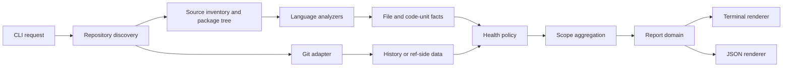

# Smackdebt architecture

## Purpose

Smackdebt answers two questions:

1. Where does a codebase carry the most costly debt?
2. Did the current change improve or worsen that debt compared with a Git ref?

The architecture keeps source parsing, Git access, health policy, aggregation,
and presentation separate. A language engine reports facts. Smackdebt decides
how to rate, group, compare, and show those facts.

## Design goals

- Useful output from `smackdebt` and `smackdebt diff` without configuration.
- Progressive views from repository to package, directory, file, container,
  and function.
- Explainable ratings made from visible measurements.
- One report domain shared by terminal and JSON output.
- Parallel file analysis with one streamed Git history pass.
- A small language interface that does not expose parser-library types.
- Partial results with honest coverage when a file cannot be analyzed.

The first release does not include a terminal UI, HTML report, server, machine
learning, call graph, duplication scan, coverage analysis, security scan,
persistent cache, or CI policy gate.

## System flow



Dependencies point toward the report and policy domain. Filesystem, Git,
`rust-code-analysis`, terminal styling, and JSON serialization remain adapters.

## Domain model

### Scope tree

`Scope` represents a node a user can inspect:

```text
repository
└── package
    └── directory
        └── file
            └── code container
                └── code unit
```

A package comes from a project manifest. A code container is a class, trait,
implementation, interface, namespace, or similar language construct. A code
unit is a named function, method, closure, or a synthetic top-level unit.

Each scope has an identity, parent, source coverage, child summaries, health
counts, findings, and optional activity. Paths stay relative to the repository
root in reports.

### Source facts

A language analyzer returns one `FileAnalysis` value:

```text
FileAnalysis
  path
  language
  source_lines
  maintainability_index
  parse_status
  units[]

CodeUnit
  identity { container_path, kind, name }
  span { start_line, end_line }
  cognitive_complexity
  cyclomatic_complexity
  logical_lines
  children[]
```

These values contain measurements, not ratings. They have no Git, terminal, or
configuration concerns.

### Health

`HealthPolicy` maps a `CodeUnit` to `Healthy`, `Watch`, or `High` and records
every signal that produced the result. The default limits live in one policy
value and can be replaced from `.smackdebt.toml`.

The highest signal sets the unit rating:

| Signal | Watch | High |
| --- | ---: | ---: |
| Cognitive complexity | 15 | 25 |
| Cyclomatic complexity | 11 | 21 |
| Logical lines | 50 | 100 |

Parent scopes aggregate counts. They do not average child ratings or expose a
single project score.

### Activity and hotspots

`FileActivity` stores distinct non-merge touches within the configured history
window. The default window is 90 days. A file has high activity when it has at
least two touches and falls in the top activity quartile among touched,
supported files in the selected scope.

A hotspot is a `Watch` or `High` unit in a high-activity file. Ordering uses:

1. health rating;
2. touch count;
3. cognitive complexity;
4. cyclomatic complexity;
5. logical lines;
6. path and span for a stable tie break.

The report prints these inputs. It does not expose a hidden hotspot score.

### Reports

`Report` is the public output model. Both renderers consume it without running
analysis:

```text
Report
  schema_version
  mode
  scope
  coverage
  health
  activity
  children[]
  findings[]
  diagnostics[]
  comparison?
```

JSON uses `schema_version: 1`. Additive fields can extend version 1. Removing a
field, changing its meaning, or changing a field type requires a new schema
version.

## Components

### CLI

The CLI parses these public forms:

```text
smackdebt [PATH]
smackdebt diff [REF] [PATH]
smackdebt --history DURATION [PATH]
smackdebt [diff ...] --json
```

It resolves configuration, creates an `AnalysisRequest`, invokes one use case,
and renders the returned report. It does not inspect source files or calculate
ratings.

### Repository discovery

Discovery resolves an explicit path first. Without one, it uses the current Git
worktree root or the current directory outside Git.

The inventory walks the selected scope once and applies Git ignore rules plus
Smackdebt exclusions. It skips binary files and known dependency or generated
directories. Unsupported, unreadable, oversized, and parse-error files become
coverage diagnostics rather than healthy files.

Package discovery recognizes `Cargo.toml`, `package.json`, `pyproject.toml`,
`pom.xml`, Gradle files, and `CMakeLists.txt`. Each source file belongs to its
nearest package ancestor. When no manifest exists, discovery creates a root
package.

### Source analysis

Core code depends on this small interface:

```rust
trait LanguageAnalyzer: Send + Sync {
    fn language(&self) -> Language;
    fn supports(&self, path: &Path, head: &[u8]) -> bool;
    fn analyze(&self, source: SourceFile<'_>) -> Result<FileAnalysis, AnalysisError>;
}
```

An analyzer receives borrowed source bytes when possible and returns owned
domain values. The registry selects one analyzer per file. Core code does not
depend on parser enums, syntax nodes, or metric structs.

The first adapter pins `rust-code-analysis` at reviewed revision
`37e5d83c056c8cbf827223d5814a93c5218df1a9`. It supports C/C++, Java,
JavaScript/JSX, Python, Rust, and TypeScript/TSX. Kotlin remains disabled until
its metrics contain real language behavior.

For C and C++, the adapter collects preprocessor data once per scan and shares
it with file analysis. The CLI does not expose the upstream preprocessing
workflow.

### Git adapter

Core code depends on a `GitRepository` interface for:

- repository and worktree discovery;
- default-ref and merge-base resolution;
- ignored and untracked paths;
- streamed history with rename detection;
- changed paths, statuses, and renames;
- base-side file bytes.

The first adapter runs `git` with structured arguments. It never builds a shell
command from paths or refs. History uses one process for the selected window,
and base objects use `git cat-file --batch`. The implementation must not run a
Git process per file.

Static analysis works without Git. In that case the report omits activity and
explains why. Diff analysis requires Git.

### Aggregation

Aggregation builds the scope tree after file analysis. It performs one
post-order pass and stores health counts, coverage, top findings, and activity
for every scope.

The adapter must not merge repository metrics through upstream
`CodeMetrics::merge`. Upstream does not combine Halstead or maintainability
values through that method, and parent syntax spaces already include their
children.

The adapter extracts file line counts and maintainability once from the root
space. For nested code units, it derives exclusive additive values by
subtracting direct child totals from the parent. It rates each function,
closure, and synthetic top-level unit once. Containers group descendants but
do not duplicate their measurements.

### Presentation

The terminal renderer receives a display width, color choice, and `Report`.
It shows the current scope, coverage, health counts, a short ranked list, and
one useful drill command. It truncates detail before paths or measurements
become unreadable. `NO_COLOR` and non-terminal output disable ANSI styling.

The JSON renderer serializes the same report. It does not maintain a second
view model.

## Codebase analysis

1. Resolve the scope, configuration, and optional Git repository.
2. Discover packages and source files in one walk.
3. Read supported files and analyze them through a shared worker pool.
4. Stream recent Git history once when available.
5. Classify code units and select hotspots.
6. Aggregate the tree and render the requested scope.

The current version of each file is analyzed once. Results move through a
channel into the aggregator so discovery does not retain every source buffer.

## Diff analysis

With no explicit ref, the Git adapter tries `origin/HEAD`, local `main`, then
local `master`. It finds the merge base of that ref and `HEAD`, then compares
the merge-base tree with the current worktree. This includes committed,
staged, unstaged, and non-ignored untracked changes.

The adapter reads rename-aware path status first. It analyzes each changed
base-side file and each changed worktree file at most once. Named symbols match
on renamed path, container path, kind, and name. A unique identity yields a
metric comparison.

Renamed symbols appear as one removal and one addition. Anonymous symbols,
duplicate identities, or parse failures fall back to file-level changes with a
diagnostic. Smackdebt does not guess a match from similar source text.

`Comparison` records added, removed, improved, regressed, and unchanged units.
A change is improved or regressed when its rating changes. Metric changes
inside the same rating remain available in file drill views and JSON.

The history window can add hotspot context to changed files. It never changes
which source versions the diff compares.

## Failure behavior

One bad file does not stop a repository report. The report includes the path,
reason, and excluded line count in `diagnostics` and `coverage`.

Smackdebt returns:

- `0` when it produced a report, regardless of health findings;
- `1` when analysis could not produce a report;
- `2` for invalid arguments or configuration.

The CLI writes the report to standard output and diagnostics about invocation
failure to standard error. JSON mode keeps standard output valid JSON.

## Performance rules

- Walk the selected filesystem scope once.
- Read and analyze a current file once.
- Analyze only changed files on each side of a diff.
- Stream Git history once for the selected window.
- Batch base-object reads.
- Use one worker pool sized from available parallelism.
- Keep stable ordering after parallel work completes.
- Borrow source bytes inside adapters and move compact facts across threads.

Large-repository tests must assert process counts as well as elapsed behavior,
so a later refactor cannot introduce one Git call per file.

## Security and privacy

Smackdebt runs locally. It does not send source, paths, metrics, or Git history
over the network. The Git adapter passes refs and paths as process arguments,
does not invoke a shell, and rejects values that cannot be represented safely.

Configuration can change exclusions and thresholds, but it cannot execute
commands or load analyzer code.

## Delivery sequence

OpenSpec tracks implementation as separate changes:

1. `add-codebase-report`: discovery, package hierarchy, source metrics, health,
   terminal output, and JSON.
2. `add-git-hotspots`: configurable history, rename-aware touches, and hotspot
   priority.
3. `add-ref-diff-report`: ref discovery, worktree comparison, symbol matching,
   regressions, and improvements.
4. `add-go-analysis`: first language engine outside `rust-code-analysis`, used
   to prove the extension interface.

Each change must include focused tests, strict OpenSpec validation, formatting,
warning-free linting, and stable acceptance output before archive.
