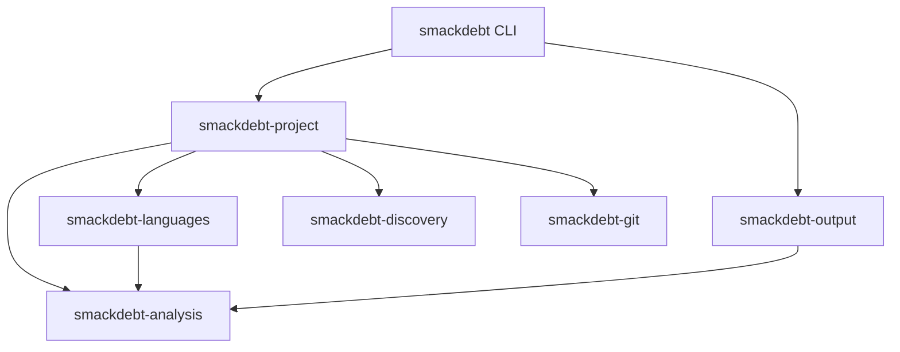

# Smackdebt architecture

Smackdebt answers two questions:

1. Where is the codebase debt, and which findings matter most now?
2. Did this worktree improve or worsen that debt compared with a Git ref?

The implementation favors small crates, inward dependencies, stable output,
and predictable memory use. Command behavior and JSON schema version 1 are the
product interfaces. Rust crate APIs remain private implementation seams.

## Crates and dependency direction

| Crate | Responsibility |
| --- | --- |
| `smackdebt-analysis` | Measurements, health policy, aggregation, comparisons, and report values |
| `smackdebt-languages` | File detection and compiled parser dispatch |
| `smackdebt-discovery` | One ignore-aware inventory and package assignment |
| `smackdebt-git` | Repository facts, history, status, refs, and object reads |
| `smackdebt-project` | Codebase and diff use cases plus the Rayon pool |
| `smackdebt-output` | Terminal and JSON writers over a borrowed report |
| `smackdebt` | Arguments, dependency construction, streams, and exit codes |

Infrastructure crates do not depend on each other. Project orchestration is the
only place that composes filesystem, language, and Git behavior. Every crate is
private until a separate release OpenSpec change approves publication.

Workspace checks read Cargo metadata and reject dependency edges outside this
diagram. Public API snapshots make cross-crate surface changes visible during
review. All workspace crates forbid unsafe Rust.

## Analysis model

Inventory owns repository-relative paths and assigns small typed indexes.
Language analysis produces a flat list of units per file. Each unit records:

- its name, container, kind, and source span;
- cognitive and cyclomatic complexity;
- exclusive logical lines;
- its parent unit index when nesting matters.

The health policy stores the three signals in fixed-size values. The highest
signal sets the result: `healthy`, `watch`, or `high`. Rating a unit does not
allocate.

The report uses flat arrays for paths, scopes, findings, diagnostics, activity,
and comparisons. Typed indexes connect related values. A path is interned once;
scopes and files refer to that path, and a comparison refers to its owning
file. A finding is owned once even when several parent summaries include its
rating. Full scans retain every `watch` and `high` finding and reduce healthy
units to counts.

The scope order is repository, package, directory, file, container, and unit.
Codebase and diff reports use the same repository-relative hierarchy. Each
report records an initial selected scope separately from its facts, so a
renderer can show the repository, a package, or a directory from one report.
Aggregation walks child scopes once in post-order and links retained findings
and comparisons through indexes. Parent scopes add counts; they never average
debt into a project score.

## Package discovery

Discovery performs one filesystem walk without reading source contents. It
applies ignore files, explicit exclusions, and generated-directory rules while
recording stable relative paths and file metadata.

A directory containing one or more recognized manifests is one package root.
Cargo, npm, Python, Maven, Gradle, CMake, Bundler, and gemspec manifests in the
same directory are ecosystem evidence for that single package. Each source file
belongs to its nearest package ancestor. A repository with no recognized
manifest gets `.` as its package.

Discovery owns the package assignment for every codebase file, including the
fallback used when a file has no manifest-root ancestor. Project hierarchy
construction consumes that package identity directly. It does not repeat
nearest-package policy from path prefixes. Diff reports derive package roots
from current and changed manifests because no discovery inventory exists for
the base tree.

Unreadable paths, links, unsupported source, oversized files, and parse errors
remain visible as coverage diagnostics. They are never counted as healthy.

## Language analysis

Language selection is a private enum and `match`, compiled into the binary.
There are no runtime plugins, analyzer trait objects, callbacks, or parser types
in public APIs.

The temporary upstream adapter pins `rust-code-analysis` revision
`37e5d83c056c8cbf827223d5814a93c5218df1a9`. It calls per-file analysis and
bypasses the upstream walker, worker setup, channels, and output. It immediately
reduces upstream data to the three measurements Smackdebt needs.

Verified upstream-backed languages are C, C++, Java, JavaScript, JSX, Python,
Rust, TypeScript, and TSX. Kotlin stays unsupported because the pinned engine
does not supply the required measurements.

Ruby and Vue are owned analyzers. Ruby reports methods, singleton methods, and
lambdas while treating classes and modules as containers. Vue delegates script
regions to JavaScript or TypeScript analysis, reports template control flow as
a template unit, and counts style regions as covered source without rating
them.

Nested syntax needs metric-specific handling. Cognitive and cyclomatic values
come from the unit itself. Exclusive logical lines subtract direct nested-unit
line totals. Repository aggregation never uses the upstream metric merge
operation.

Replacing an upstream-backed language requires compatibility fixtures, an
owned implementation, performance evidence, and one registry switch. No other
crate should change.

## Execution and memory ownership

Project orchestration creates one private Rayon pool. `--jobs N` fixes its
width; otherwise it uses available parallelism. One-file work stays serial.
Indexed parallel collection preserves the same order as serial execution.

Discovery owns paths. The project crate opens each selected current file once
and moves its source buffer into analysis. A worker owns parser and scratch
state and reuses them across files. In a diff, one worker holds at most the base
and worktree buffers for its current file. Source memory therefore follows
active worker count instead of repository size.

Health policy runs on analysis workers. Healthy details are reduced before
results return to aggregation. Terminal and JSON output write directly to an
`io::Write` destination from borrowed report data; the output crate does not
build a second owned report.

## Git process shape

Git commands use structured arguments and never invoke a shell. Refs and paths
are passed separately. Static codebase analysis works outside Git; diff mode
requires a repository.

Codebase activity uses one streamed, non-merge, rename-aware history process.
Activity orders existing debt using visible inputs: health, touch count, the
three measurements, path, and span. It never changes a health rating and does
not hide a numeric score.

Diff mode resolves an explicit ref or tries `origin/HEAD`, `main`, then
`master`. It compares from the merge base through committed, staged, unstaged,
renamed, deleted, and non-ignored untracked worktree changes. One
`git cat-file --batch` process supplies base objects through a small queue. The
number of Git processes does not grow with the changed-file count.

Named units match by path after rename handling, container, kind, and name.
Results are added, removed, improved, regressed, metric-changed, ambiguous, or
unchanged. Unclear identity, unsupported source, and parse failure produce a
file-level comparison diagnostic instead of a guessed match.

## Output and failure behavior

Terminal output first builds private borrowed presentation rows for the
selected summary, ranked areas, leading details, coverage notes, and drill
command. Ranking, omission, and navigation happen once. Full, compact, and
stacked writers then consume those rows without scanning the report or running
analysis. This seam can support a later interactive renderer without putting
terminal state in the report domain or promising a public Rust interface.

The CLI resolves width and color before calling output. `COLUMNS` takes
priority, followed by terminal width or a 100-column redirected default.
Automatic color requires a terminal and no `NO_COLOR`; explicit always and
never modes override that choice. The output crate reads no environment or
terminal state. Styling uses semantic 16-color roles with no backgrounds, and
removing its ANSI sequences yields the plain output byte for byte.

Every layout shows a summary, progressive debt or change distribution, concise
detail, and one useful drill command. It passes through single-child structural
scopes with visible breadcrumbs, limits area rows to ten debt-bearing areas and
detail to three by default, and summarizes healthy-only areas as quiet.
Codebase rows show debt share, local attention rate, and a fractional rate bar;
diff rows show exact directions and a share bar. Locations and commands remain
whole. Finding detail names only signals that reached Watch or High, while diff
detail names only changed measurements. Terminal-only `--all` restores every
area and retained detail.

JSON starts with `schema_version: 1` and retains all `watch` and `high`
findings, aggregate healthy counts, coverage, activity, diagnostics, and diff
facts when present. It also exposes the selected scope, indexed paths, scope
finding/comparison links, three-way diff counts, comparison ownership, and
derived direction. Additive fields may extend version 1. Removing a field,
changing its meaning, or changing its type requires a new schema version.

Exit codes describe report production, not code health:

- `0`: report produced;
- `1`: analysis could not produce a report;
- `2`: invalid arguments or configuration.

One bad file does not stop a codebase report. Invocation failures go to standard
error. JSON standard output stays valid when the report contains non-fatal
diagnostics.

## Performance evidence

Correctness tests run outside measured intervals for generated one-file,
one-hundred-file, small-diff, and large mixed-language workloads. Serial and
parallel terminal and JSON output must match byte for byte.

Instrumentation records inventory visits, source reads, allocations, Git
processes, wall time, p95, peak memory, supported files, and source bytes.
Cachegrind and DHAT commands cover complete CLI flows where the host supports
them. A private Fluyt command also records revision, dirty state, host, and
toolchain.

The first trustworthy run sets checked latency and memory limits with ten
percent regression room. Changing a workload creates an explicit new baseline.
A regression is investigated before a limit changes.

## Security and privacy

Smackdebt runs locally and does not upload source, paths, metrics, or Git
history. Configuration changes exclusions, thresholds, history, and worker
count only. It cannot execute commands or load analyzer code. No async runtime
or persistent cache is part of the first release.
