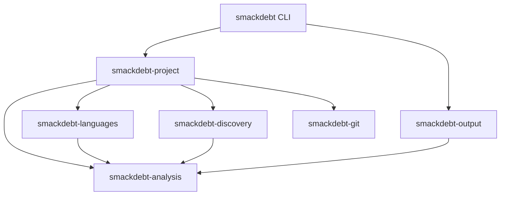

# Smackdebt architecture

Smackdebt answers two questions:

1. Where is the codebase debt, and which findings matter most now?
2. Did this worktree improve or worsen that debt compared with a Git ref?

The implementation favors small crates, inward dependencies, stable output,
and predictable memory use. Command behavior and JSON schema version 4 are the
product interfaces. Rust crate APIs remain private implementation seams.

## Crates and dependency direction

| Crate | Responsibility |
| --- | --- |
| `smackdebt-analysis` | Measurements, health policy, static graph algorithms, aggregation, comparisons, and report values |
| `smackdebt-languages` | File detection, compiled parser dispatch, and grammar-specific dependency syntax |
| `smackdebt-discovery` | One ignore-aware inventory and package assignment |
| `smackdebt-git` | Repository facts, history, status, refs, and object reads |
| `smackdebt-project` | Codebase and diff use cases, dependency resolution, and the Rayon pool |
| `smackdebt-output` | Terminal and JSON writers over borrowed source and graph facts |
| `smackdebt` | Arguments, dependency construction, streams, and exit codes |

Infrastructure crates do not depend on each other. Languages and discovery use
analysis-owned values at their seams, but do not depend on another adapter.
Project orchestration is the only place that composes filesystem, language, and
Git behavior. Every crate is private until a separate release OpenSpec change
approves publication.

Workspace checks read Cargo metadata and reject dependency edges outside this
diagram. Compiler-visible API snapshots make cross-crate surface changes
visible during review. All workspace crates forbid unsafe Rust.

## Module and API rules

`lib.rs` and `mod.rs` are wiring files. They may declare private modules,
import names, and explicitly reexport the small interface used by another
crate. They do not contain behavior, inline modules, wildcard reexports, or
tests. The CLI `main.rs` is an exception only for its call into the application
module and return of the process exit code.

Implementation stays in responsibility-led files. Analysis separates source
facts, health policy, comparisons, and completed reports. Language dispatch
keeps grammar-specific syntax separate from shared measurements. The
project crate separates public requests from execution, discovery separates
ignore matching from inventory, and output separates JSON serialization from
terminal presentation. The CLI separates arguments, configuration, terminal
policy, and application execution. Other crates add a module only when it gives
a responsibility a clear owner; file size by itself is not a reason to add a
layer.

Types own their behavior. A completed report is read-only outside analysis and
is created through `ReportBuilder`; callers cannot mutate its tables or rerun
aggregation. `Analyzer`, `Inventory`, `GitRepository`, project requests, and
output options likewise expose actions instead of public fields or plumbing
types. The `unreachable_pub` lint rejects public declarations that no consumer
can reach. The entry-module check and compiler-visible API snapshots run in the
architecture gate.

## Analysis model

Inventory owns repository-relative paths. Analysis owns shared package and
report indexes, and discovery assigns the package index during its walk.
Language analysis produces a flat list of units per file. Each unit records:

- its name, container, kind, and source span;
- cognitive and cyclomatic complexity;
- exclusive logical lines;
- its parent unit index when nesting matters.

The health policy stores the three signals in fixed-size values. The highest
signal sets the result: `healthy`, `watch`, or `high`. Rating a unit does not
allocate.

The report uses flat arrays for paths, scopes, findings, diagnostics, activity,
and comparisons. Typed indexes connect related values. A path is interned once;
scopes and files refer to that path, and a comparison refers to its owning
file. A finding is owned once even when several parent summaries include its
rating. Full scans retain every `watch` and `high` finding and reduce healthy
units to counts.

The scope order is repository, package, directory, file, container, and unit.
Codebase and diff reports use the same repository-relative hierarchy.
`ProjectReport` records the initial selected scope separately from report
facts, so a renderer can show the repository, a package, or a directory from
one report.
Aggregation walks child scopes once in post-order and links retained findings
and comparisons through indexes. Parent scopes add counts; they never average
debt into a project score.

Analysis also owns the verdict: the one statement those counts support. Tier
identifiers are frozen as the machine contract and their sentences are owned
beside them, so a terminal renderer and a machine consumer print identical
bytes. A codebase tier comes from integer permille of High debt over checked
units, where a boundary value belongs to the lower tier, and package dependency
cycles floor the result at `worn` from one finding and at `fights_back` from
three. No floating-point value participates. A diff tier reconciles source,
architecture, and evolutionary movement in one decision from the debt-diff
selection: the typed identities that count as human debt movement. Healthy
added or removed units, unchanged and ambiguous comparisons, and fixture or
generated source stay in the machine report and never move a verdict. Every
family keeps its own counts, including zero counts, so a report can name the
family that moved. The worst offender is the top of the same finding rank with
its path resolved once, falling back to the first witness of a package cycle.
The root verdict completes while the report is built, and any other retained
scope is answered by a pure function of the completed report, so no renderer
performs analysis to get one.

## Package discovery

Discovery performs one filesystem walk without reading source contents. It
applies ignore files and explicit exclusions while recording stable relative
paths and file metadata. Source-role classification handles generated files
instead of excluding a whole directory by name.

Role classification has one fixed order: explicit configuration,
language-owned generated markers, generic filename and path rules, then the
primary fallback. Conflicting matches at one level stop configuration with
status 2. Primary, test, example, and benchmark source participate in default
verdicts; fixture and generated source remain context. Each language owns its
generated marker syntax, while discovery owns only generic path and filename
rules.

A directory containing one or more recognized manifests is one package root.
Cargo, npm, Python, Maven, Gradle, CMake, Bundler, and gemspec manifests in the
same directory are ecosystem evidence for that single package. Each source file
belongs to its nearest package ancestor. A repository with no recognized
manifest gets `.` as its package.

Discovery owns the package assignment for every codebase file, including the
fallback used when a file has no manifest-root ancestor. Project hierarchy
construction consumes that package identity directly. It does not repeat
nearest-package policy from path prefixes. Diff reports derive package roots
from current and changed manifests because no discovery inventory exists for
the base tree.

Unreadable paths, links, unsupported source, oversized files, and parse errors
remain visible as coverage diagnostics. They are never counted as healthy.

## Language analysis

Language selection is a private enum and `match`, compiled into the binary.
There are no runtime plugins, analyzer trait objects, callbacks, or parser types
in public APIs.

The language crate has a private generic `Language` trait and one concrete
marker implementation per grammar. Static dispatch chooses `analyze::<Rust>`,
`analyze::<Ruby>`, or another compiled implementation. A language owns its node
kinds, fields, unit names, containers, recovery exceptions, control-flow
meaning, logical statements, and injection regions. Shared measurement code
never matches a grammar node name. Dependency syntax joins this private seam in
the static architecture change, when project resolution can consume it.

One iterative traversal classifies each node visited in a rated unit and feeds
three independent modules. Cognitive complexity owns structural, nesting,
alternative, jump, and boolean-run state. Cyclomatic complexity owns decision
counts. Logical lines own statement counts. A nested rated unit is skipped in
its parent's traversal and measured separately, so direct complexity and
exclusive statements need no child-result subtraction. The same traversal
collects the deepest nesting level reached, and the language contract reports
the unit's declared parameter count through a shared default. Both are exposed
as measurements and are not rated until `adopt-report-schema-v4` promotes
them.

The engine constructs analysis-owned `FileAnalysis` and `UnitFact` values
directly. Tree-sitter nodes, trees, grammars, and semantic traversal values do
not cross the language crate seam. C, C++, Java, JavaScript, JSX, Python, Rust,
TypeScript, TSX, Ruby, and Vue have checked exact fixtures. Kotlin remains a
visible unsupported file and contributes no healthy unit.

Vue is a document grammar. It parses each JavaScript or TypeScript `script`
region from a borrowed slice, keeps the region's original line offset, and
creates a separate template unit. Template directives and expressions feed the
same metric modules. Style regions count toward document coverage without
creating a rated unit.

Adding a language means adding its private marker, syntax translation, exact
unit and metric fixtures, recovery and original-span fixtures, nested-unit
proof, serial/parallel proof, and performance evidence. Shared algorithms
change only when the measurement rule itself changes.

## Static dependency analysis

Each language implementation translates its import forms during the existing
tree traversal. A dependency syntax value contains its kind, raw target, source
span, and ordered path candidates, or an explicit external or unresolved state.
This grammar-owned step performs no filesystem or Git access. Vue combines
dependencies from its JavaScript or TypeScript script regions while preserving
document line numbers.

Project orchestration builds one read-only file index from discovery paths and
package identities. It joins relative candidates to the source directory and
root candidates to the repository. A reference becomes an internal edge only
when exactly one file matches. No match is external when the language supplied
a fixed package target; a dynamic or malformed target stays unresolved. Several
matches are ambiguous. Supported project configuration is read as data and is
never executed.

Analysis owns one flat file edge per directed file pair. Repeated references
increment its reference count and retain representative locations. Package
edges are derived from unique cross-package file pairs and record both file-pair
and reference counts. External dependencies and resolution diagnostics remain
outside the internal graph.

Separate pure modules calculate strongly connected components, stable concise
cycle witnesses, unique fan-in and fan-out, exact instability fractions, and
before/after graph comparisons. They consume integer-indexed edges and have no
parser, path, filesystem, Git, Rayon, serialization, or terminal access. Nodes
and neighbors use stable path order, so worker completion order cannot change a
witness or report byte.

A package cycle is a High architecture finding. A file cycle inside one package
is Watch. A package that depends on a less stable package with at least two
references into it is a Watch stable-dependency finding, decided by integer
cross-multiplication of the degree operands rather than a float. A supported
primary file with no incoming verdict edge that is not an entry file is a
descriptive orphan fact. Fan-in, fan-out, instability, reference counts, and coverage are
descriptive facts. Architecture findings and source findings use separate flat
tables and separate summary counts.

Diff analysis inventories the current repository once. Changed files provide
both current and base dependency syntax, while unchanged current analyses supply
the return paths needed by each graph. Rename aliases are entered before
resolution. The comparison therefore detects a changed edge that closes or
opens a path through unchanged files. Introduced package cycles are Worse,
removed package cycles are Better, and other edge changes are Changed.

Terminal output filters graph detail to edges and findings involving the
selected scope, including incoming edges from outside it. The retained report
and JSON keep the complete root graph. Output borrows those facts and does not
run resolution or graph algorithms.

This graph is intentionally static. It does not execute build files, expand
macros, trace runtime loading, or provide compiler-grade call or type graphs.
Unclear identity stays visible in dependency coverage instead of producing a
guessed edge.

## Execution and memory ownership

Project orchestration creates one private Rayon pool. `--jobs N` fixes its
width; otherwise it uses available parallelism. One-file work stays serial.
Indexed parallel collection preserves the same order as serial execution.

Discovery owns paths. The project crate opens each selected current file once
and moves its source buffer into analysis. A worker owns one parser per grammar
and reuses it across files. Trees and borrowed nodes live only until that file's
facts are complete; query cursors, traversal stacks, semantic observations, and
result scratch remain with the worker and retain capacity between files.
Compiled unit queries are retained by grammar and their mutable cursors are not
shared between workers. Vue borrows included source ranges instead of copying
the complete document. A diff worker holds at most the base and worktree buffers
for its current file. Source memory therefore follows active worker count
instead of repository size.

Health policy runs on analysis workers. Healthy details are reduced before
results return to aggregation. Terminal and JSON output write directly to an
`io::Write` destination from borrowed report data; the output crate does not
build a second owned report.

Dependency syntax is collected during the same parse and root traversal as
source measurements. Project resolution uses the existing source result and
does not add a filesystem walk, source read, or parse.

## Git process shape

Git commands use structured arguments and never invoke a shell. Refs and paths
are passed separately. Static codebase analysis works outside Git; diff mode
requires a repository.

Codebase evolution uses one streamed, non-merge, rename-aware history process.
The Git crate emits one compact commit at a time with normalized opaque
contributor identity, timestamp, rename records, and optional textual line
counts. It retains no commit message or source text. Project composition joins
those paths to the current inventory, follows unbroken rename chains from a
current file to its earlier names, and converts contributor identity to a
temporary integer before calling analysis.

Analysis owns separate churn, change-coupling, contributor-concentration,
knowledge-concentration, and evolutionary-comparison modules. Package activity and contributor activity count
once per commit. Change coupling counts each unordered package pair once per
commit. Default findings require at least three shared commits and 20% Jaccard
similarity; weaker observations remain available through JSON and `--all`. A
recurrent pair without a static package edge in either direction creates a
Watch finding. All ratios retain their numerator and denominator. Output only reads the completed
aggregate tables; contributor names, addresses, raw fields, and temporary
identifiers cannot enter a report value.

The selected history window is applied once, where streamed records become
facts, so activity, churn, coupling, and concentration describe the same
commits. History coverage states the window length and how many streamed commits
the window excluded, counted separately from changes excluded for other reasons.

History is anchored to files and package assignments in the current inventory.
Deleted files and old package layouts are not reconstructed. Binary changes add
a commit without line churn. Excluded paths and rename gaps are counted. Shallow
or interrupted streams are marked incomplete, and unavailable history leaves
source and static architecture analysis intact.

Activity orders existing debt using visible inputs: health, distinct commit count, the
rated measurements, path, and span. It never changes a health rating and does
not hide a numeric score. Diff analysis attaches the same retained history to
changed files and packages as context. Only a worktree static edge can add or
remove an unexplained-coupling finding; history itself has no before and after
direction. Human diff output names the two packages and states whether they now
or no longer change together without a code dependency. It does not expose the
internal comparison type name.

Diff mode resolves an explicit ref or tries `origin/HEAD`, `main`, then
`master`. It compares from the merge base through committed, staged, unstaged,
renamed, deleted, and non-ignored untracked worktree changes. One
`git cat-file --batch` process supplies base objects through a small queue. The
number of Git processes does not grow with the changed-file count.

Named units match by path after rename handling, container, kind, and name.
Results are added, removed, improved, regressed, metric-changed, ambiguous, or
unchanged. Unclear identity, unsupported source, and parse failure produce a
file-level comparison diagnostic instead of a guessed match.

## Output and failure behavior

Analysis owns the exact source finding rank: rating, role class, hot state,
count of signals at that rating, total triggered signals, cognitive complexity,
cyclomatic complexity, logical lines, activity, path, then span. Role class
keeps primary source above non-primary source at equal rating without removing
it, and hot state decides among findings of the same rating and role class. Hot
state comes from the hotspot table, which crosses a file's rated units with its
windowed touch count. Hotspot and size input comes only from trusted
parsed source in a verdict role, so advisory recovered facts and context fixture
or generated files stay descriptive however often they change.

The verdict, its tier sentence, its counts, and the worst offender with its
resolved path and reason are completed analysis facts. The renderer prints them
and never composes a sentence, derives a tier, or computes a count. Terminal
output builds private borrowed presentation rows once for the verdict block,
affected areas, ranked findings or debt-moving comparisons, relevant
relationships, history rows, warnings, and next command. Selection, joining, and
navigation happen once in that presentation step; the renderer performs no
filesystem, Git, parser, or analysis work, and a path view reads owned tables
only. This seam can support a later interactive renderer without putting
terminal state in the report domain or promising a public Rust interface.

Row shape is decided per row from that row's own content rather than from
report-level width tiers. A row stays on one line when its content fits the
resolved width and otherwise writes its head, then its location, then its facts
on indented lines, one fact per line when they no longer share one. Text that
still exceeds the width continues on the next line, preferring a word boundary
and then a path separator, so measurements, counts, cycle witnesses, history
evidence, dependency state, commands, and identities are never shortened away
and no ellipsis is written. A final line writer measures visible width without
counting ANSI sequences and safely shortens an unexpected overflow without
splitting a glyph or escape sequence. Tests count that safety path directly:
every reviewed 50-column flow has zero uses, while a synthetic overflow proves
it still works.

Words carry every meaning. The human vocabulary is `high`, `watch`, `worse`,
`better`, `changed`, `warning`, and `next:`. A glyph and the tier-colored `▌`
bar are decoration: they may appear beside a word, never instead of it, and a
new decorated element requires an adjacent word that carries its meaning and
undecorated output that remains complete.

The CLI resolves width, color, and decoration before calling output. `COLUMNS`
takes priority, followed by terminal width or a 100-column redirected default.
Automatic color requires a terminal and no `NO_COLOR`; automatic decoration
requires a terminal only, so `NO_COLOR` removes styling while a terminal keeps
its glyphs. Explicit always and never modes override both choices, and there is
no separate decoration option. The output crate reads no environment or terminal
state. Only decoration receives color, with an immediate reset, so removing ANSI
sequences yields the plain decorated bytes and removing decoration yields the
piped bytes.

The decoration vocabulary is High U+F024, Watch U+F0EB, Discover U+F46B, Worse
U+F062, Better U+F063, Changed U+F111, Warning U+F071, and the tier bar U+258C.
High and Worse are red, Watch and Warning use ANSI-256 color 208, Discover is
cyan, Better is green, Changed uses the normal text color, and the bar uses its
tier color. Each occupies one display cell. Undecorated output contains no
codepoint in U+E000–U+F8FF, which every public piped flow asserts.

The verdict block always appears. `AREAS` appears only for several debt-bearing
children and shows at most five with word-labeled counts. `FINDINGS` shows at
most three ranked source findings or debt-moving comparisons. `ARCHITECTURE`
appears for rated graph findings, stacks each cycle witness one step per line,
and states stable-dependency rows with their integer instability operands.
`HISTORY` appears for at most three actionable rows, ordered by shared commits
descending, similarity descending, then stable package names and IDs, and adds
knowledge-concentration rows as counts. `WARNINGS` groups one sentence per kind.
A diff that moves no debt writes the verdict block and nothing after it.

Empty optional sections, healthy rows, bars, summary ratios, processing totals,
raw dependency edges, references outside the repository, churn totals,
cyclomatic-one values, weak coupling, and omission bookkeeping stay out of every
human view. `--all` removes the useful-debt limits without turning the terminal
into a complete export. Path views retain incoming and outgoing debt-bearing
relationships. JSON remains the complete view of everything the terminal omits.
Every coupling row in `--all` and path views retains shared commits, union
commits, similarity, and whether a code dependency exists.

Human warnings group file problems and use short sentences. History and rename
gaps and imports that could not be followed have stable wording. Detailed and
path views may add affected-file context without repeating the same summary for
each file. The three common input failures — a missing path, a missing Git ref,
and `--all --json` — write one exact line to standard error with no usage tail,
no absolute path, and no operating-system or Git text.

JSON starts with `schema_version: 4` and then answers the common question
before any table. `verdict` states the frozen tier id, its analysis-owned
sentence, and the mode; `summary` states the checked, high, watch, and
High-architecture counts, the word-labeled debt-diff totals, and up to three
fully resolved worst offenders carrying path strings. The head is a bounded
denormalization of facts the tables also carry, produced from the same
completed verdict, and acceptance rebuilds it from those tables.

One package table owns stable package IDs,
repository-relative paths, scope links, current or base-only presence, and the
name a manifest declares.
Files expose SourceRole, parse outcome, and trust. Findings retain unit kind,
role, trust, measurements, and spans, including recovered advisory facts that
do not enter health or diff verdicts. Static relations expose `uses` or
`module_ownership` separately from role, trust, resolution, and locations.
History keeps eligible and context mappings separate and exposes exact churn,
coupling, and concentration operands, plus the selected window. Hotspots, size
findings, orphan files, stable-dependency findings, and knowledge-concentration
findings each own their table, and each finding family states its own `kind`,
because each owns its own identity type in analysis. Every serialized value is
an integer or a string: similarity and concentration ratios are derived from
serialized operands rather than published as floats. The output crate streams
this model from borrowed report facts, and `schemas/report-v4.schema.json` plus
black-box snapshots check it. There is no older serializer or command-line
version selector.

Static architecture adds dependency coverage, file relations, package edges,
external summaries, resolution diagnostics, package measurements, architecture
findings, and architecture comparisons. These are flat indexed tables; source
and architecture health remain independent. Default terminal output shows
rated cycle witnesses without arbitrary edge samples. `--all` and path drill
show relevant imports, ownership, external, advisory, unmatched, and
multiple-match evidence in direct human wording. Primary and trusted labels are
omitted; non-primary roles and advisory trust appear only when useful. Diff
cycles use a short change line followed by the closed arrow path, and edge
changes use arrow or ownership rows with added or removed wording. Human
activity rows say `commit` or `commits`; retained JSON names stay unchanged.

The release baseline workflow is `scripts/performance/release-baselines.sh`.
It requires a clean tree, captures one revision/toolchain/host state, and then
records all eight profiles against that starting state. Each measured command
first validates its JSON against the committed schema and semantic facts, then
checks serial/automatic bytes and a reviewed report digest. Parser
timing is diagnostic evidence on standard error only in the allocation build;
it is not part of terminal or JSON product output.

Exit codes describe report production, not code health:

- `0`: report produced;
- `1`: analysis could not produce a report;
- `2`: invalid arguments or configuration.

One bad file does not stop a codebase report. Invocation failures go to standard
error. JSON standard output stays valid when the report contains non-fatal
diagnostics.

## Performance evidence

Correctness tests run outside measured intervals for generated one-file,
one-hundred-file, small-diff, and large mixed-language workloads. Serial and
parallel terminal and JSON output must match byte for byte.

Instrumentation records inventory visits, source and object reads, parser
visits, algorithm passes, allocations, Git processes, wall time, p95, peak
memory, supported files, and source bytes.
Cachegrind and DHAT commands cover complete CLI flows where the host supports
them. A private Fluyt command also records revision, dirty state, host, and
toolchain.

The first trustworthy run sets checked latency and memory limits with ten
percent regression room. Changing a workload creates an explicit new baseline.
A regression is investigated before a limit changes.

## Test and acceptance evidence

The test suite separates six kinds of proof:

- pure policy tests check exact health, graph, history, and comparison rules
  without filesystem or process setup;
- language truth fixtures check syntax translation, source spans, recovery,
  nested units, and exact measurements;
- adapter tests check discovery and Git behavior at their crate seams;
- black-box acceptance tests start the built `smackdebt` process and check its
  status, stdout, stderr, schema, values, and exact bytes;
- allocation checks measure complete, already-correct command flows;
- performance workloads add repeated timing, peak memory, reads, and process
  counts to those complete flows.

The acceptance harness creates public repositories and invokes the command. It
does not construct a report, call analysis APIs, or repeat analysis policy.
Feature-gated work counters observe actual inventory visits, reads, Git
processes, parser visits, algorithm entry points, and renderer entry. The
renderer check snapshots counters immediately before and after presentation.
These counters do not enter normal terminal or JSON output. A policy change belongs first in a pure truth test; a
public behavior change also requires schema review and updated black-box
evidence.

Committed terminal and JSON files are read-only during normal tests. The
`update-unified-snapshot` command updates one named result or the complete set
and prints every path it changes. The install smoke places the locked command
under a temporary prefix and runs it from a generated repository outside this
workspace.

Static graph workloads cover a sparse 1,000-file graph, a dense 500-file graph,
1,000 packages, and a 200-file dependency diff over a 1,000-file repository.
Their generated identities and edge shapes are checked before timing. Storage
follows files and observed relationships rather than every possible file pair.
The recorded runs include graph correctness and serial/parallel equality checks,
wall time, parser time, peak resident memory, allocations, source reads,
inventory work, and Git process counts.

## Security and privacy

Smackdebt runs locally and does not upload source, paths, metrics, or Git
history. Configuration changes exclusions, thresholds, history, and worker
count only. It cannot execute commands or load analyzer code. No async runtime
or persistent cache is part of the first release.
