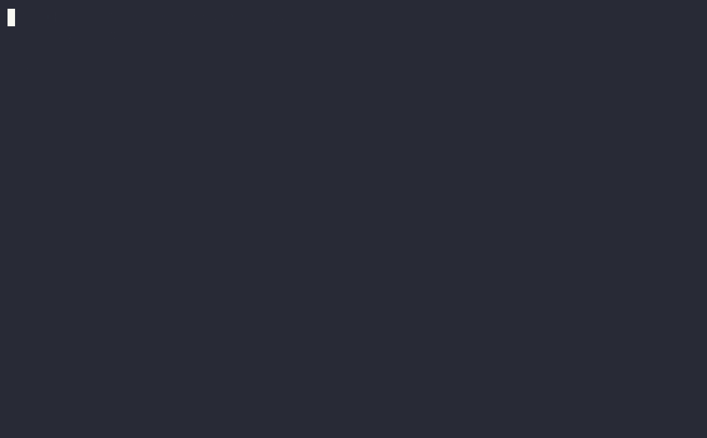

# Smackdebt

**Help your AI agent write code you can follow.**

Your agent finished the feature. Now you have to untangle it.

Smackdebt gives coding agents concrete feedback on complexity, tangled dependencies,
and code that keeps causing work. They can find the trouble, simplify it, and check
whether their changes helped before handing the code back to you.

Analysis runs locally. No service, account, or API key required.



## Get it

For Linux x86_64 and macOS (Intel or Apple Silicon):

```sh
curl -fsSL https://github.com/bosun-ai/smackdebt/releases/latest/download/install.sh | sh
```

Or choose Homebrew or Cargo:

```sh
brew install bosun-ai/tap/smackdebt
# or
cargo binstall smackdebt
```

Then give your agent the skill:

```sh
smackdebt init
```

Choose **Codex, Claude Code, Cursor, Copilot, or Gemini CLI**, then restart your agent.
Rerun `init` after upgrading to update its skill. [Agent setup →](docs/agents.md)

Installers arrive with the next published release. Until then, build from this
checkout with Rust 1.97+: `cargo install --locked --path crates/cli`.

## Give “make it cleaner” some teeth

Ask your agent:

> Use Smackdebt to review this change. Simplify the code where you've made it
> harder to follow, then run the tests and check the diff again.

The skill guides your agent to inspect the affected code before editing, compare
against its starting commit afterward, and fix regressions within the task.
For a required CI check, [set up a debt gate](docs/guide.md#gate).

You can run the same checks yourself:

```sh
smackdebt                 # Find the trouble spots
smackdebt src/auth        # Zoom in
smackdebt diff main       # Did this change help?
smackdebt --json          # Use the report in your own tools
```

## Less spaghetti, with receipts

The first five metrics rate each function **healthy**, **watch**, or **high**.
The rest show trouble between files and over time.

| Metric | What it measures |
| --- | --- |
| Cognitive complexity | How hard the flow is to follow. |
| Cyclomatic complexity | How many decisions the code makes. |
| Statements in a function | How many statements it contains. |
| Maximum nesting depth | How deep branches and loops go. |
| Declared parameters | How many inputs a function takes. |
| Dependency cycles | Dependencies that lead back to themselves. |
| Change impact | How much code depends on a file. |
| Hotspots | Complex code changed often. |

Use `--all` for detail. [Measurements](docs/guide.md#read-the-ratings) ·
[Problem patterns](docs/guide.md#read-the-problems) · [Checked examples](docs/examples.md)

## Languages

**C, C++, C#, Go, Java, JavaScript/JSX, PHP, Python, Ruby, Rust, TypeScript/TSX,
and Vue** (scripts and templates). React uses JSX/TSX support. Reports flag
unsupported files and parse failures so you can see what the check missed.

---

[User guide](docs/guide.md) · [JSON schemas](schemas/README.md) ·
[Architecture](ARCHITECTURE.md) · [Development & releases](RELEASING.md)

MIT licensed. Built with [tree-sitter](https://tree-sitter.github.io/tree-sitter/).
